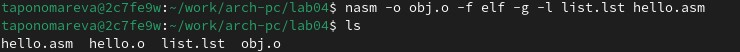
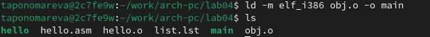
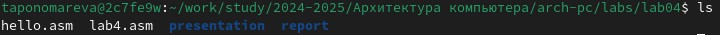

---
## Front matter
title: "Отчёт по лабораторной работе №4"
subtitle: "Дисциплина: архитектура компьютера"
author: "Пономарева Татьяна Александровна"

## Generic otions
lang: ru-RU
toc-title: "Содержание"

## Bibliography
bibliography: bib/cite.bib
csl: pandoc/csl/gost-r-7-0-5-2008-numeric.csl

## Pdf output format
toc: true # Table of contents
toc-depth: 2
lof: true # List of figures
lot: true # List of tables
fontsize: 12pt
linestretch: 1.5
papersize: a4
documentclass: scrreprt
## I18n polyglossia
polyglossia-lang:
  name: russian
  options:
	- spelling=modern
	- babelshorthands=true
polyglossia-otherlangs:
  name: english
## I18n babel
babel-lang: russian
babel-otherlangs: english
## Fonts
mainfont: IBM Plex Serif
romanfont: IBM Plex Serif
sansfont: IBM Plex Sans
monofont: IBM Plex Mono
mathfont: STIX Two Math
mainfontoptions: Ligatures=Common,Ligatures=TeX,Scale=0.94
romanfontoptions: Ligatures=Common,Ligatures=TeX,Scale=0.94
sansfontoptions: Ligatures=Common,Ligatures=TeX,Scale=MatchLowercase,Scale=0.94
monofontoptions: Scale=MatchLowercase,Scale=0.94,FakeStretch=0.9
mathfontoptions:
## Biblatex
biblatex: true
biblio-style: "gost-numeric"
biblatexoptions:
  - parentracker=true
  - backend=biber
  - hyperref=auto
  - language=auto
  - autolang=other*
  - citestyle=gost-numeric
## Pandoc-crossref LaTeX customization
figureTitle: "Рис."
tableTitle: "Таблица"
listingTitle: "Листинг"
lofTitle: "Список иллюстраций"
lotTitle: "Список таблиц"
lolTitle: "Листинги"
## Misc options
indent: true
header-includes:
  - \usepackage{indentfirst}
  - \usepackage{float} # keep figures where there are in the text
  - \floatplacement{figure}{H} # keep figures where there are in the text
---

# Цель работы

Освоение процедуры компиляции и сборки программ, написанных на ассемблере NASM.

# Выполнение лабораторной работы

 Сначала создаем каталог для работы с программами на языке ассемблера NASM, потом переходим в созданный каталог и создаем текстовый файл с именем hello.asm (рис. [- @fig:001]).
 
{#fig:001 width=80%}

 Открываем файл hello.asm при помощи gedit и редактируем (рис. [- @fig:002]).
 
{#fig:002 width=80%}

 Используем NASM для превращения текста программы в объектный код. Проверим полученный файл, используя ls. Имеем объектный файл hello.o (рис. [- @fig:003]).

{#fig:003 width=80%}

 Скомпилируем исходный файл hello.asm в obj.o и проверим созданные файлы при помощи ls (рис. [- @fig:004]).

{#fig:004 width=80%}

 Передаем объектный файл на обработку компоновщику и проверяем, чтобы исполняемый файл hello был создан, при помощи ls (рис. [- @fig:005]).

{#fig:005 width=80%}

 Зададим имя создаваемого исполняемого файла main. Имя объектного файла - obj.o (рис. [- @fig:006]).

{#fig:006 width=80%}

 Запустим на выполнение созданный исполняемый файл hello, находящийся в текущем каталоге (рис. [- @fig:007]).

{#fig:007 width=80%}

# Выполнение заданий самостоятельной работы

 Сначала в каталоге ~/work/arch-pc/lab04 с помощью команды cp создадим копию файла hello.asm с именем lab4.asm. Потом внесем изменения в текст программы при помощи любого текстового редактора. Оттранслируем полученный текст программы lab4.asm в объектный файл и выполним компоновку объектного файла. Запустим получившийся исполняемый файл (рис. [- @fig:008]).

{#fig:008 width=80%}

 Скопируем файлы hello.asm и lab4.asm в локальный репозиторий в каталог ~/work/study/2023-2024/"Архитектура компьютера"/arch-pc/labs/lab04/ (рис. [- @fig:009]).

{#fig:009 width=80%}

 Загрузим файлы на Github.

# Выводы

Были освоены процедуры компиляции и сборки программ, написанных на ассемблере NASM.

