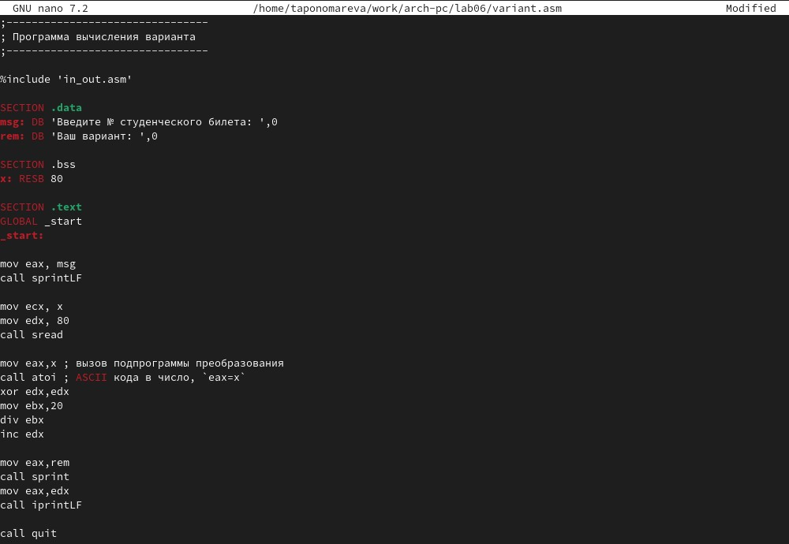
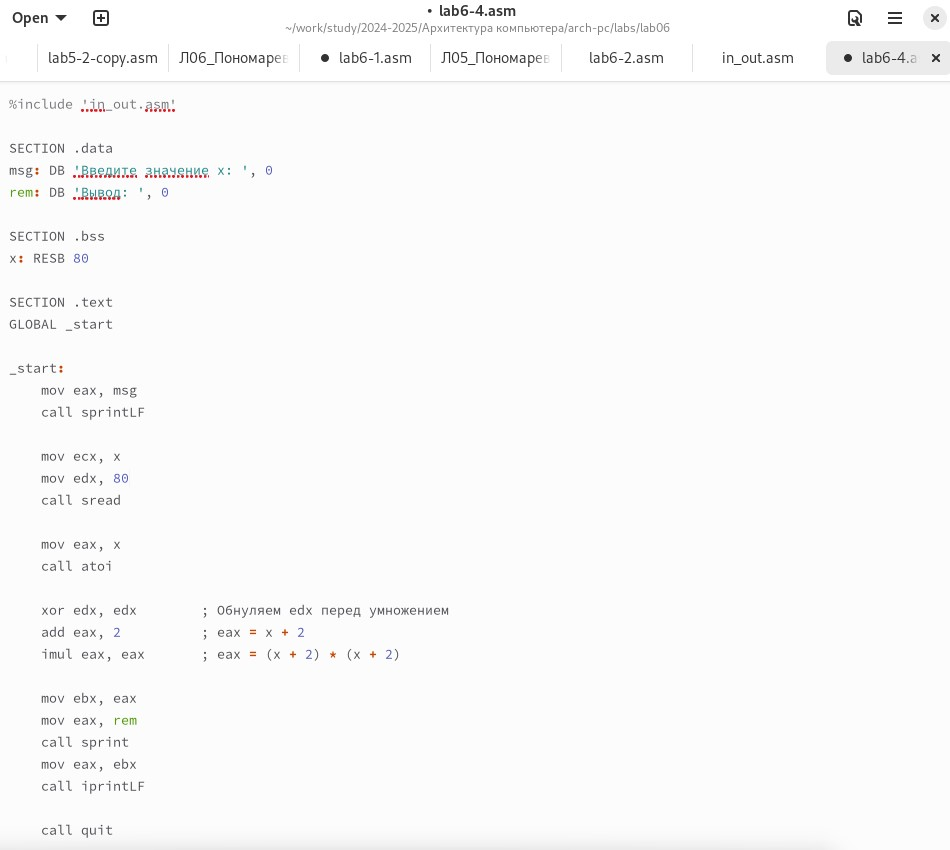

---
## Front matter
title: "Отчёт по лабораторной работе №6"
subtitle: "Дисциплина: Архитектура компьютера"
author: "Пономарева Татьяна Александровна"

## Generic otions
lang: ru-RU
toc-title: "Содержание"

## Bibliography
bibliography: bib/cite.bib
csl: pandoc/csl/gost-r-7-0-5-2008-numeric.csl

## Pdf output format
toc: true # Table of contents
toc-depth: 2
lof: true # List of figures
lot: true # List of tables
fontsize: 12pt
linestretch: 1.5
papersize: a4
documentclass: scrreprt
## I18n polyglossia
polyglossia-lang:
  name: russian
  options:
	- spelling=modern
	- babelshorthands=true
polyglossia-otherlangs:
  name: english
## I18n babel
babel-lang: russian
babel-otherlangs: english
## Fonts
mainfont: IBM Plex Serif
romanfont: IBM Plex Serif
sansfont: IBM Plex Sans
monofont: IBM Plex Mono
mathfont: STIX Two Math
mainfontoptions: Ligatures=Common,Ligatures=TeX,Scale=0.94
romanfontoptions: Ligatures=Common,Ligatures=TeX,Scale=0.94
sansfontoptions: Ligatures=Common,Ligatures=TeX,Scale=MatchLowercase,Scale=0.94
monofontoptions: Scale=MatchLowercase,Scale=0.94,FakeStretch=0.9
mathfontoptions:
## Biblatex
biblatex: true
biblio-style: "gost-numeric"
biblatexoptions:
  - parentracker=true
  - backend=biber
  - hyperref=auto
  - language=auto
  - autolang=other*
  - citestyle=gost-numeric
## Pandoc-crossref LaTeX customization
figureTitle: "Рис."
tableTitle: "Таблица"
listingTitle: "Листинг"
lofTitle: "Список иллюстраций"
lotTitle: "Список таблиц"
lolTitle: "Листинги"
## Misc options
indent: true
header-includes:
  - \usepackage{indentfirst}
  - \usepackage{float} # keep figures where there are in the text
  - \floatplacement{figure}{H} # keep figures where there are in the text
---

# Цель работы

Освоение арифметических инструкций языка ассемблера NASM.

# Выполнение лабораторной работы
## Символьные и численные данные в NASM

Создаю каталог для программам лабораторной работы № 6 , далее перехожу в него и
создаю файл lab6-1.asm (рис. [-@fig:001]).

{#fig:001 width=70%}

Ввожу в файл lab6-1.asm текст программы из листинга 6.1 (рис. [-@fig:002]).

{#fig:002 width=70%}

Создаю исполняемый файл lab6-1 и запускаю его (рис. [-@fig:003]).

{#fig:003 width=70%}

Далее изменяю текст программы и вместо символов, пишу в регистры числа (рис. [-@fig:004]).

{#fig:004 width=70%}

Создаю исполняемый файл lab6-1 и запускаю его (рис. [-@fig:005]).

{#fig:005 width=70%}

Согласно таблице ASCII, код 10 соответствует символу перевода строки (newline), который обозначается как LF (Line Feed). Символ с кодом 10 (перевод строки) не отображается визуально при выводе на экран. Вместо этого он вызывает действие — переход на новую строку.

Создаю файл lab6-2.asm в каталоге ~/work/arch-pc/lab06 при помощи команды touch ~/work/arch-pc/lab06/lab6-2.asm (рис. [-@fig:006]).

{#fig:006 width=70%}

Ввожу в него текст программы из листинга 6.2 (рис. [-@fig:007]).

{#fig:007 width=70%}

Создаю исполняемый файл lab6-2 и запускаю его (рис. [-@fig:008]).

{#fig:008 width=70%}

Аналогично предыдущему примеру изменяю символы на числа (рис. [-@fig:009]).

{#fig:009 width=70%}

Создаю исполняемый файл lab6-2 и запускаю его. В терминале выводится 10 (рис. [-@fig:0010]).

{#fig:0010 width=70%}

Заменяю функцию iprintLF на iprint (рис. [-@fig:0011]).

{#fig:0011 width=70%}

Создаю исполняемый файл lab6-2 и запускаю его. iprintLF добавляет перевод строки после числа, а iprint выводит число без переноса строки (рис. [-@fig:0012]).

{#fig:0012 width=70%}

## Выполнение арифметических операций в NASM

Создаю файл lab6-3.asm в каталоге ~/work/arch-pc/lab06 при помощи команды touch ~/work/arch-pc/lab06/lab6-3.asm (рис. [-@fig:0013]).

{#fig:0013 width=70%}

Ввожу в lab6-3.asm текст программы из листинга 6.3 (рис. [-@fig:0014]).

{#fig:0014 width=70%}

Создаю исполняемый файл lab6-3 и запускаю его (рис. [-@fig:0015]).

{#fig:0015 width=70%}

Изменяю текст программы для вычисления выражения f(x) = (4 * 6 + 2)/5 (рис. [-@fig:0016]).

{#fig:0016 width=70%}

Создаю исполняемый файл lab6-3 и проверяю его работу (рис. [-@fig:0017]).

{#fig:0017 width=70%}

Создаю файл variant.asm в каталоге ~/work/arch-pc/lab06 (рис. [-@fig:0018]).

{#fig:0018 width=70%}

Ввожу в variant.asm текст программы из листинга 6.4 (рис. [-@fig:0019]).

{#fig:0019 width=70%}

Создаю исполняемый файл variant и запускаю его. Ввожу свой номер студенческого билета - 1132246742. Получаю вариант 3 (рис. [-@fig:0020]).

{#fig:0020 width=70%}

Программа делит номер студенческого билета на 20, сохраняет остаток в регистре edx, а затем увеличивает его на 1 с помощью инструкции inc edx, что приводит к тому, что результат деления с остатком дает вариант 3.

1) За вывод на экран сообщения "Ваш вариант:" отвечают следующие строки:
```
mov eax,rem
call sprint 
```
Эти строки загружают строку "Ваш вариант:" в регистр eax и затем вызывают подпрограмму sprint, которая отвечает за вывод строки на экран.

2)
```
mov ecx, x
mov edx, 80
call sread
```
Эти инструкции загружают адрес переменной для ввода данных и максимальную длину строки, затем вызывают подпрограмму sread для чтения ввода с клавиатуры.

3) Инструкция call atoi вызывается для преобразования строки, содержащей ASCII-коды, в целое число, которое сохраняется в регистре eax.

4) За вычисления варианта отвечают следующие строки:
```
mov eax,x         ; Загружаем число из переменной x в регистр eax
call atoi         ; Преобразуем строку в число (номер студенческого билета)
xor edx,edx       ; Обнуляем регистр edx, чтобы он использовался для остатка от деления
mov ebx,20        ; Загружаем делитель (20) в регистр ebx
div ebx           ; Делим eax на ebx, результат в eax, остаток в edx
inc edx           ; Увеличиваем остаток на 1, получаем вариант
```

5) Остаток от деления при выполнении инструкции div ebx записывается в регистр edx.

6) Инструкция inc edx используется для увеличения остатка от деления в регистре edx на 1.

7) За вывод на экран результата вычислений отвечают следующие строки:
```
mov eax,rem         ; Загружаем адрес строки 'Ваш вариант:' в регистр eax
call sprint         ; Выводим строку "Ваш вариант:"
mov eax,edx         ; Загружаем результат (вариант) из регистра edx в eax
call iprintLF       ; Выводим значение из eax (номер варианта)
```
# Задание для самостоятельной работы

Создаю файл lab6-4.asm в каталоге ~/work/arch-pc/lab06 при помощи touch ~/work/arch-pc/lab06/lab6-4.asm (рис. [-@fig:0021]).

{#fig:0021 width=70%}

Вписываю текст программы в файл lab6-4.asm для вычисления выражения y=f(x). У меня вариант 3, т.е. y=(2 + x)^2, x1=2, x2=8 (рис. [-@fig:0022]).

{#fig:0022 width=70%}

Ответ. При x1=2, имеем 16, при x2=8, имеем 100 (рис. [-@fig:0023]).

{#fig:0023 width=70%}

Загружаю на GitHub.

# Выводы

В ходе лабораторной работы были освоены арифметические инструкции языка ассемблера NASM.

# Список литературы{.unnumbered}

1. [Курс на ТУИС](https://esystem.rudn.ru/course/view.php?id=112)
2. [Лабораторная работа №6](https://esystem.rudn.ru/pluginfile.php/2089086/mod_resource/content/0/%D0%9B%D0%B0%D0%B1%D0%BE%D1%80%D0%B0%D1%82%D0%BE%D1%80%D0%BD%D0%B0%D1%8F%20%D1%80%D0%B0%D0%B1%D0%BE%D1%82%D0%B0%20%E2%84%966.%20%D0%90%D1%80%D0%B8%D1%84%D0%BC%D0%B5%D1%82%D0%B8%D1%87%D0%B5%D1%81%D0%BA%D0%B8%D0%B5%20%D0%BE%D0%BF%D0%B5%D1%80%D0%B0%D1%86%D0%B8%D0%B8%20%D0%B2%20NASM..pdf)
