---
## Front matter
title: "Отчёт по лабораторной работе №7"
subtitle: "Дисциплина: Архитектура компьютера"
author: "Пономарева Татьяна Александровна"

## Generic otions
lang: ru-RU
toc-title: "Содержание"

## Bibliography
bibliography: bib/cite.bib
csl: pandoc/csl/gost-r-7-0-5-2008-numeric.csl

## Pdf output format
toc: true # Table of contents
toc-depth: 2
lof: true # List of figures
lot: true # List of tables
fontsize: 12pt
linestretch: 1.5
papersize: a4
documentclass: scrreprt
## I18n polyglossia
polyglossia-lang:
  name: russian
  options:
	- spelling=modern
	- babelshorthands=true
polyglossia-otherlangs:
  name: english
## I18n babel
babel-lang: russian
babel-otherlangs: english
## Fonts
mainfont: IBM Plex Serif
romanfont: IBM Plex Serif
sansfont: IBM Plex Sans
monofont: IBM Plex Mono
mathfont: STIX Two Math
mainfontoptions: Ligatures=Common,Ligatures=TeX,Scale=0.94
romanfontoptions: Ligatures=Common,Ligatures=TeX,Scale=0.94
sansfontoptions: Ligatures=Common,Ligatures=TeX,Scale=MatchLowercase,Scale=0.94
monofontoptions: Scale=MatchLowercase,Scale=0.94,FakeStretch=0.9
mathfontoptions:
## Biblatex
biblatex: true
biblio-style: "gost-numeric"
biblatexoptions:
  - parentracker=true
  - backend=biber
  - hyperref=auto
  - language=auto
  - autolang=other*
  - citestyle=gost-numeric
## Pandoc-crossref LaTeX customization
figureTitle: "Рис."
tableTitle: "Таблица"
listingTitle: "Листинг"
lofTitle: "Список иллюстраций"
lotTitle: "Список таблиц"
lolTitle: "Листинги"
## Misc options
indent: true
header-includes:
  - \usepackage{indentfirst}
  - \usepackage{float} # keep figures where there are in the text
  - \floatplacement{figure}{H} # keep figures where there are in the text
---

# Цель работы

Изучение команд условного и безусловного переходов. Приобретение навыков написания
программ с использованием переходов. Знакомство с назначением и структурой файла
листинга.

# Теоретическое введение

Для реализации ветвлений в ассемблере используются так называемые команды передачи
управления или команды перехода. Можно выделить 2 типа переходов:
• условный переход – выполнение или не выполнение перехода в определенную точку
программы в зависимости от проверки условия.
• безусловный переход – выполнение передачи управления в определенную точку программы без каких-либо условий.

# Выполнение лабораторной работы
##  Реализация переходов в NASM

Создаю каталог для программам лабораторной работы № 7, перехожу в него и создаю файл lab7-1.asm (рис. [-@fig:001]).

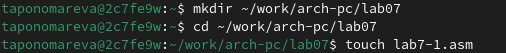{#fig:001 width=70%}

Ввожу в файл lab7-1.asm текст программы из листинга 7.1 (рис. [-@fig:002]).

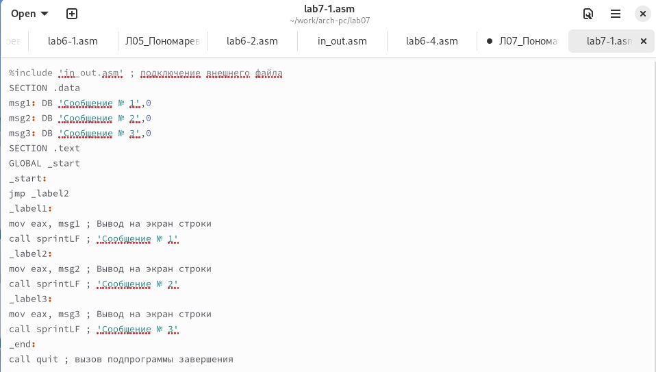{#fig:002 width=70%}

Создаю исполняемый файл и запускаю его (рис. [-@fig:003]). Программа изменяет порядок вывода сообщений при использовании безусловного перехода.

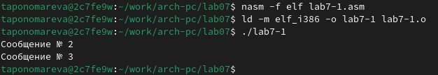{#fig:003 width=70%}

Изменяю файл lab7-1.asm в соответствии с Листингом 7.2 (рис. [-@fig:004]).

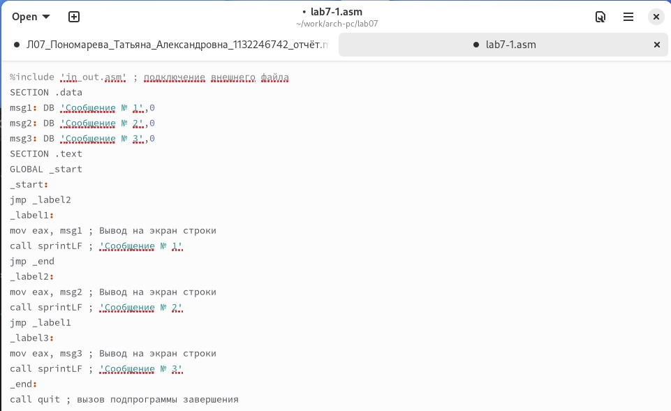{#fig:004 width=70%}

Создаю исполняемый файл, запускаю его и проверяю его работу (рис. [-@fig:005]). Программа выводит следующее: Сообщение №2, Сообщение №1.

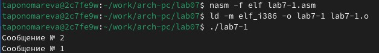{#fig:005 width=70%}

Изменяю lab7-1.asm (рис. [-@fig:006]).

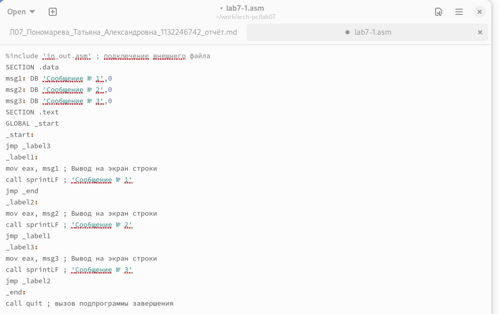{#fig:006 width=70%}

Создаю исполняемый файл, запускаю его и проверяю корректность его работы (рис. [-@fig:007]). При помощи неусловного перехода получаем такой порядок вывода: Сообщение №3, Сообщение №2, Сообщение №1.

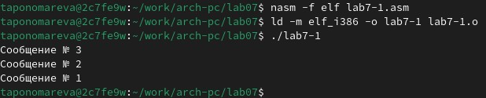{#fig:007 width=70%}

Создаю файл lab7-2.asm в каталоге ~/work/arch-pc/lab07 (рис. [-@fig:008]).

{#fig:008 width=70%}

Ввожу текст программы из листинга 7.3 в lab7-2.asm (рис. [-@fig:009]).

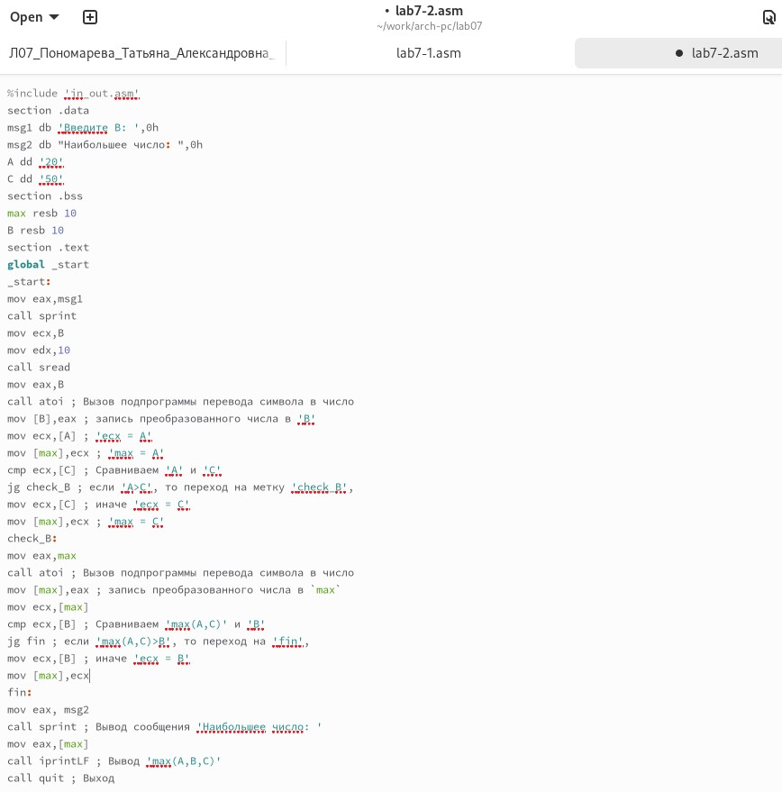{#fig:009 width=70%}

Создаю исполняемый файл lab7-2, запускаю его и проверяю корректность его работы (рис. [-@fig:0010]). Программа выводит наибольшее число.

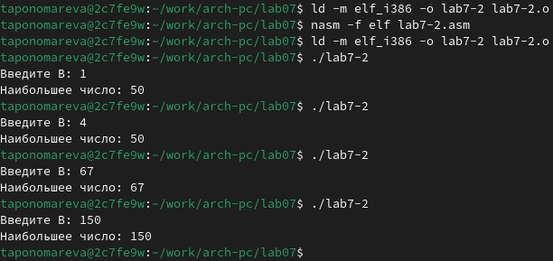{#fig:0010 width=70%}

## Изучение структуры файлы листинга

Создаю файл листинга для программы из файла lab7-2.asm при помощи команды nasm -f elf -l lab7-2.lst lab7-2.asm
(рис. [-@fig:0011]).

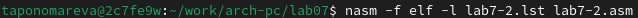{#fig:0011 width=70%}

Открываю файл листинга lab7-2.lst с помощью mcedit (рис. [-@fig:0012]).

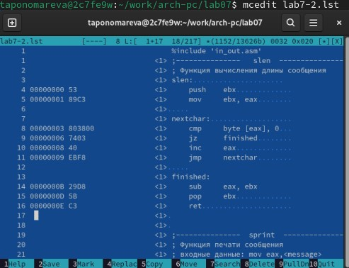{#fig:0012 width=70%}

Объяснение трех строк из листинга lab7-2.lst:
```
8 00000003 803800              <1>     cmp     byte [eax], 0 - Эта строка проверяет, равен ли байт по адресу, хранящемуся в EAX, нулю.

9 00000006 7403                <1>     jz      finished      - Если байт по адресу [eax] равен 0, выполнение программы переходит к метке finished. Если байт не равен 0, выполнение продолжится со следующей команды. 74 — код команды jz, а 03 — смещение (в байтах) для перехода. В данном случае переход произойдет на 3 байта вперед.

10 00000008 40                  <1>     inc     eax          - Если байт по адресу [eax] не равен 0, то значение регистра EAX увеличивается на 1.

8, 9, 10 - номера строк кода.  00000003, 00000006, 00000008 - смещения инструкций в памяти. 803800, 7403, 40 - машинный код инструкции, например, 803800 для byte [eax], 0 (80 указывает на инструкцию, которая выполняет арифметическую или логическую операцию между байтом в памяти (или регистре) и 8-битным числовым значением., 38 говорит процессору выполнить команду cmp (сравнение) для значения в памяти, адрес которой содержится в eax, 00 - значение, с которым мы сравниваем); 7403 для jz finished (03 - смещение на 3 байта вперед); 40 для inc eax.
```
Открываю файл lab7-2.asm и удаляю один из операндов (рис. [-@fig:0013]).

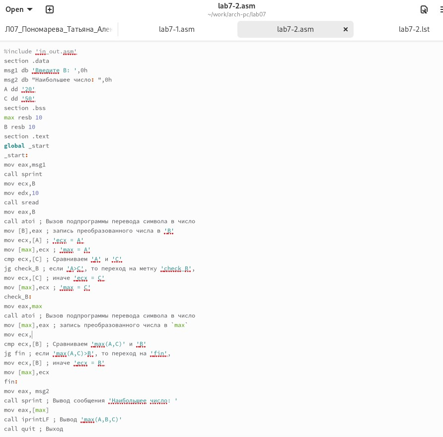{#fig:0013 width=70%}

Создаю файл листинга для программы из измененного файла lab7-2.asm и проверяю его на корректную работу (рис. [-@fig:0014]).

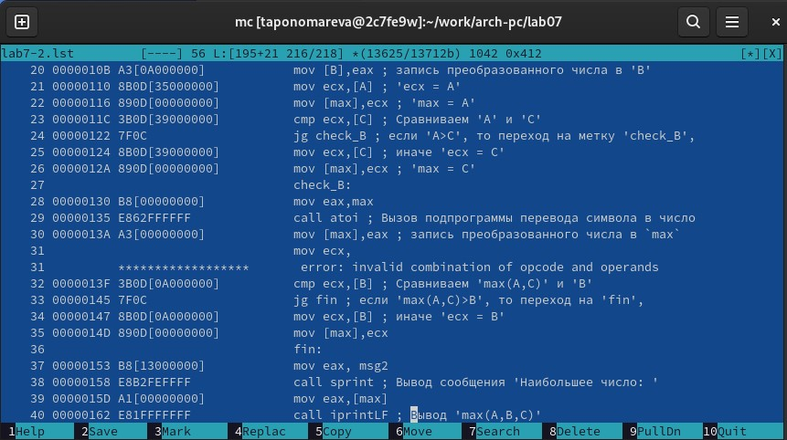{#fig:0014 width=70%}

Файл листинга lab7-2.lst дает ошибку при транслировании файла. В этом случае никакие выходные файлы не создаются и ничего в листинг не добавляется.

# Задания для самостоятельной работы
1) Из лабораторной работы №6 у меня вариант 3. Значения a, b, c: 94, 5, 58
 Код программы, находящей наименьшее из 3 переменных из файла lab7-4-1.asm
 
```
%include 'in_out.asm'

SECTION .data
msg1 db 'Введите B: ', 0h
msg2 db 'Наименьшее число: ', 0h
A dd 94 
C dd 58 

SECTION .bss
B resd 1          ; Переменная для хранения числа B
min resd 1        ; Переменная для хранения минимального числа

SECTION .text
GLOBAL _start
_start:

    ; Вывод сообщения "Введите B: "
    mov eax, msg1
    call sprint

    ; Чтение строки и преобразование в число
    mov ecx, B
    mov edx, 10
    call sread
    mov eax, B
    call atoi
    mov [B], eax  ; Сохраняем введенное число B

    ; Инициализируем min значением A
    mov eax, [A]
    mov [min], eax

    ; Сравнение с C
    mov eax, [min]
    cmp eax, [C]
    jg check_B
    mov eax, [C]
    mov [min], eax

check_B:
    ; Сравнение с B
    mov eax, [min]
    cmp eax, [B]
    jb fin
    mov eax, [B]
    mov [min], eax

fin:
    ; Вывод сообщения "Наименьшее число: "
    mov eax, msg2
    call sprint

    ; Вывод результата
    mov eax, [min]
    call iprintLF

    ; Завершение программы
    call quit
```
Создаю исполняемый файл lab7-4-1, запускаю его и проверяю корректность его работы (рис. [-@fig:0015]). Программа выводит наименьшее число.

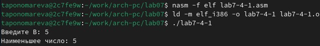{#fig:0015 width=70%}

2) Вариант 3.
Программа, которая принимает на вход x, a и выводит значение функции f(x).
```
%include 'in_out.asm'

SECTION .data
msgX db 'Enter x: ', 0            
msgA db 'Enter a: ', 0           
resultMsg db 'f(x) = ', 0         
  
            
SECTION .bss
x resd 1                         
a resd 1                         
result resd 1                     

SECTION .text
GLOBAL _start

_start:
    mov eax, msgX                
    call sprint
    mov ecx, x                    
    mov edx, 10                  
    call sread
    mov eax, x
    call atoi                  
    mov [x], eax                
    
    mov eax, msgA               
    call sprint
    mov ecx, a                 
    mov edx, 10               
    call sread
    mov eax, a
    call atoi                     
    mov [a], eax                

    mov eax, [x]                
    cmp eax, 3                   
    je compute_3x                 

    mov eax, [a]             
    add eax, 1                  
    jmp display_result         

compute_3x:
    mov eax, [x]               
    imul eax, 3                   

display_result:
    mov [result], eax             
    mov eax, resultMsg           
    call sprint
    mov eax, [result]            
    call iprintLF               
    call quit    
```

Создаю исполняемый файл lab7-4-2, запускаю его и проверяю корректность его работы (рис. [-@fig:0016]).

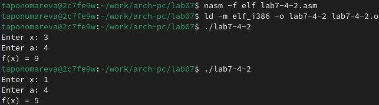{#fig:0016 width=70%}

Загружаю на GitHub.

# Выводы

В ходе лабораторной работы были изучены команды условного и безусловного переходов. Были приобретены навыки написания
программ с использованием переходов. Также было произведено знакомство с назначением и структурой файла
листинга.

# Список литературы{.unnumbered}

1. [Курс на ТУИС](https://esystem.rudn.ru/course/view.php?id=112)
2. [Лабораторная работа №7](https://esystem.rudn.ru/pluginfile.php/2089087/mod_resource/content/0/%D0%9B%D0%B0%D0%B1%D0%BE%D1%80%D0%B0%D1%82%D0%BE%D1%80%D0%BD%D0%B0%D1%8F%20%D1%80%D0%B0%D0%B1%D0%BE%D1%82%D0%B0%20%E2%84%967.%20%D0%9A%D0%BE%D0%BC%D0%B0%D0%BD%D0%B4%D1%8B%20%D0%B1%D0%B5%D0%B7%D1%83%D1%81%D0%BB%D0%BE%D0%B2%D0%BD%D0%BE%D0%B3%D0%BE%20%D0%B8%20%D1%83%D1%81%D0%BB%D0%BE%D0%B2%D0%BD%D0%BE%D0%B3%D0%BE%20%D0%BF%D0%B5%D1%80%D0%B5%D1%85%D0%BE%D0%B4%D0%BE%D0%B2%20%D0%B2%20Nasm.%20%D0%9F%D1%80%D0%BE%D0%B3%D1%80%D0%B0%D0%BC%D0%BC%D0%B8%D1%80%D0%BE%D0%B2%D0%B0%D0%BD%D0%B8%D0%B5%20%D0%B2%D0%B5%D1%82%D0%B2%D0%BB%D0%B5%D0%BD%D0%B8%D0%B9..pdf)
