---
## Front matter
title: "Отчёт по лабораторной работе №8"
subtitle: "Дисциплина: Архитектура компьютера"
author: "Пономарева Татьяна Александровна"

## Generic otions
lang: ru-RU
toc-title: "Содержание"

## Bibliography
bibliography: bib/cite.bib
csl: pandoc/csl/gost-r-7-0-5-2008-numeric.csl

## Pdf output format
toc: true # Table of contents
toc-depth: 2
lof: true # List of figures
lot: true # List of tables
fontsize: 12pt
linestretch: 1.5
papersize: a4
documentclass: scrreprt
## I18n polyglossia
polyglossia-lang:
  name: russian
  options:
	- spelling=modern
	- babelshorthands=true
polyglossia-otherlangs:
  name: english
## I18n babel
babel-lang: russian
babel-otherlangs: english
## Fonts
mainfont: IBM Plex Serif
romanfont: IBM Plex Serif
sansfont: IBM Plex Sans
monofont: IBM Plex Mono
mathfont: STIX Two Math
mainfontoptions: Ligatures=Common,Ligatures=TeX,Scale=0.94
romanfontoptions: Ligatures=Common,Ligatures=TeX,Scale=0.94
sansfontoptions: Ligatures=Common,Ligatures=TeX,Scale=MatchLowercase,Scale=0.94
monofontoptions: Scale=MatchLowercase,Scale=0.94,FakeStretch=0.9
mathfontoptions:
## Biblatex
biblatex: true
biblio-style: "gost-numeric"
biblatexoptions:
  - parentracker=true
  - backend=biber
  - hyperref=auto
  - language=auto
  - autolang=other*
  - citestyle=gost-numeric
## Pandoc-crossref LaTeX customization
figureTitle: "Рис."
tableTitle: "Таблица"
listingTitle: "Листинг"
lofTitle: "Список иллюстраций"
lotTitle: "Список таблиц"
lolTitle: "Листинги"
## Misc options
indent: true
header-includes:
  - \usepackage{indentfirst}
  - \usepackage{float} # keep figures where there are in the text
  - \floatplacement{figure}{H} # keep figures where there are in the text
---

# Цель работы

Приобретение навыков написания программ с использованием циклов и обработкой
аргументов командной строки.

# Теоретическое введение

Стек — это структура данных, организованная по принципу LIFO («Last In — First Out» или «последним пришёл — первым ушёл»). Стек является частью архитектуры процессора и реализован на аппаратном уровне. Для работы со стеком в процессоре есть специальные регистры (ss, bp, sp) и команды.

# Выполнение лабораторной работы

## Реализация циклов в NASM

Создаю каталог для программ лабораторной работы № 8, перехожу в него и создаю файл lab8-1.asm (рис. [-@fig:001]).

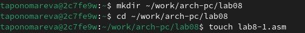{#fig:001 width=70%}

Ввожу в файл lab8-1.asm текст программы из листинга 8.1 (рис. [-@fig:002]).

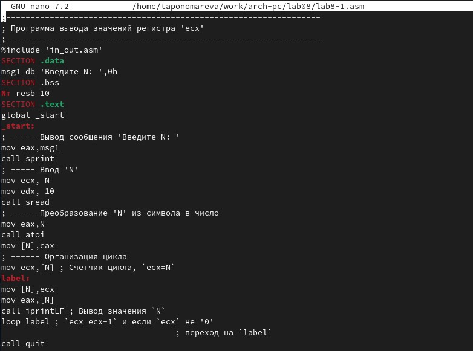{#fig:002 width=70%}

Создаю исполняемый файл и проверяю его работу (рис. [-@fig:003]). Программа демонстрирует работу циклов в NASM.

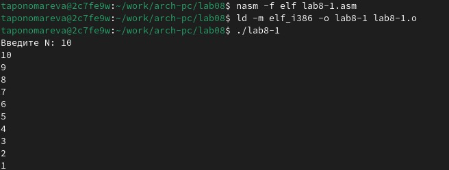{#fig:003 width=70%}

Изменяю текст программы, добавив изменение значение регистра ecx в цикле (рис. [-@fig:004]).

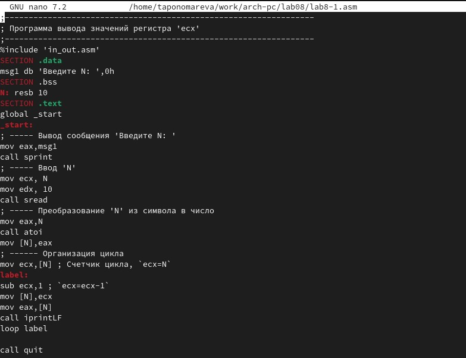{#fig:004 width=70%}

Создаю исполняемый файл с измененным содержанием и проверяю его работу (рис. [-@fig:005]). Поскольку значение регистра ecx уменьшается на 2 в каждой итерации, общее количество итераций сокращается вдвое. Число проходов цикла не соответствует значению N, введенному с клавиатуры.

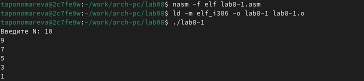{#fig:005 width=70%}

Внесу изменения в текст программы, добавив команды pushи pop для сохранения значения счетчика цикла loop (рис. [-@fig:006]).

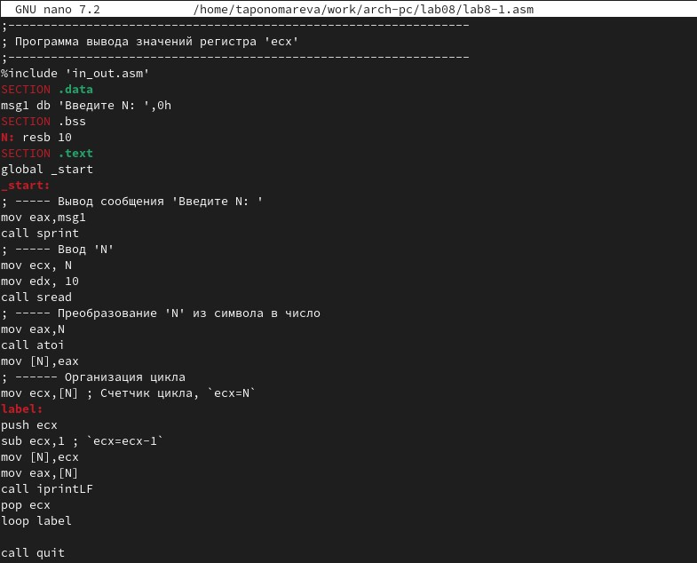{#fig:006 width=70%}

Снова создаю исполняемый файл и проверяю его работу (рис. [-@fig:007]). Заметим, что число проходов цикла соответствует значению N, введеному с клавиатуры, но выводимые значения смещены на -1. 

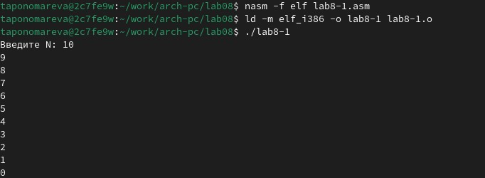{#fig:007 width=70%}

##  Обработка аргументов командной строки

Создаю файл lab8-2.asm в каталоге ~/work/arch-pc/lab08 и ввожу в него текст программы из листинга 8.2 (рис. [-@fig:008]).

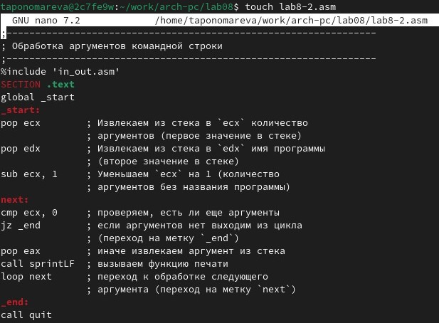{#fig:008 width=70%}

Компилирую исполняемый файл и проверяю его выполнение (рис. [-@fig:009]). Программой было обработано 3 аргумента.

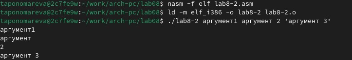{#fig:009 width=70%}

Создаю файл lab8-3.asm в каталоге ~/work/archpc/lab08 и ввожу в него текст программы из листинга 8.3 (рис. [-@fig:0010]).

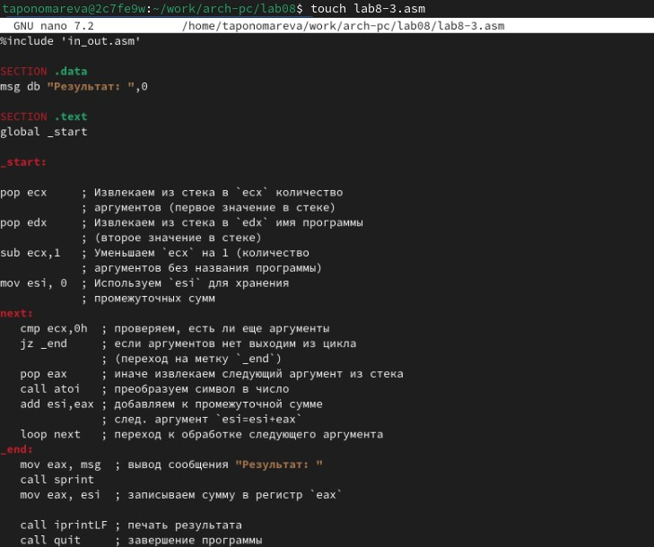{#fig:0010 width=70%}

Создаю исполняемый файл и запускаю его, указав аргументы (рис. [-@fig:0011]). Результат программы - 47.

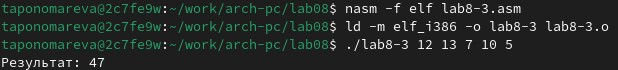{#fig:0011 width=70%}

Изменяю текст программы из листинга 8.3 для вычисления произведения аргументов
командной строки (рис. [-@fig:0012]).

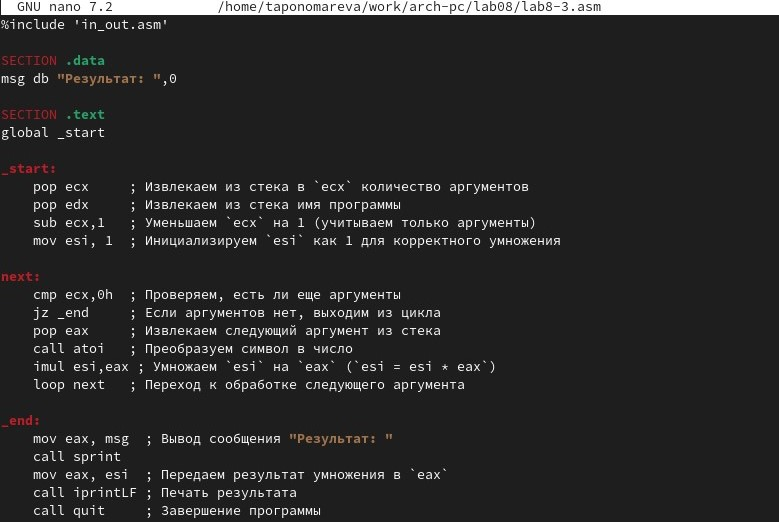{#fig:0012 width=70%}

Создаю исполняемый файл и запускаю его (рис. [-@fig:0013]). Программа перемножает вводимые числа.

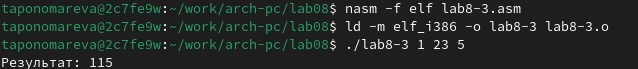{#fig:0013 width=70%}

# Задание для самостоятельной работы

У меня вариант №3.

Пишу программу, которая находит сумму значений функции f(x)=10x-5 для x = x1,x2,x3,...,xn, т.е. выводит f(x1)+f(x2)+...+f(xn).

Код программы для варианта №3
```
%include 'in_out.asm'

SECTION .data
msg_function db "Функция: f(x) = 10x - 5", 0
msg_res db "Результат: ", 0

SECTION .text
GLOBAL _start

_start:
   mov eax, msg_function
   call sprintLF

   pop ecx
   pop edx
   sub ecx, 1
   mov esi, 0

next:
   cmp ecx, 0h
   jz _end
   pop eax
   call atoi

   mov ebx, 10
   mul ebx
   sub eax, 5
   add esi, eax
   loop next

_end: 
   mov eax, msg_res
   call sprint
   mov eax, esi
   call iprintLF
   call quit
```

Создаю исполняемый файл lab8-4 и запускаю его (рис. [-@fig:0014]). Программа работает корректно (рис. [-@fig:0014]).

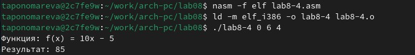{#fig:0014 width=70%}

Загружаю отчёт на GitHub.

# Выводы

В ходе выполнения лабораторной работы были приобретены навыки написания программ с использованием циклов и обработки аргументов командной строки.

# Список литературы{.unnumbered}

1. [Курс на ТУИС](https://esystem.rudn.ru/course/view.php?id=112)
2. [Лабораторная работа №8](https://esystem.rudn.ru/pluginfile.php/2089095/mod_resource/content/0/%D0%9B%D0%B0%D0%B1%D0%BE%D1%80%D0%B0%D1%82%D0%BE%D1%80%D0%BD%D0%B0%D1%8F%20%D1%80%D0%B0%D0%B1%D0%BE%D1%82%D0%B0%20%E2%84%968.%20%D0%9F%D1%80%D0%BE%D0%B3%D1%80%D0%B0%D0%BC%D0%BC%D0%B8%D1%80%D0%BE%D0%B2%D0%B0%D0%BD%D0%B8%D0%B5%20%D1%86%D0%B8%D0%BA%D0%BB%D0%B0.%20%D0%9E%D0%B1%D1%80%D0%B0%D0%B1%D0%BE%D1%82%D0%BA%D0%B0%20%D0%B0%D1%80%D0%B3%D1%83%D0%BC%D0%B5%D0%BD%D1%82%D0%BE%D0%B2%20%D0%BA%D0%BE%D0%BC%D0%B0%D0%BD%D0%B4%D0%BD%D0%BE%D0%B9%20%D1%81%D1%82%D1%80%D0%BE%D0%BA%D0%B8..pdf)
