---
## Front matter
title: "Отчёт по лабораторной работе №9"
subtitle: "Дисциплина: Архитектура компьютера"
author: "Пономарева Татьяна Александровна"

## Generic otions
lang: ru-RU
toc-title: "Содержание"

## Bibliography
bibliography: bib/cite.bib
csl: pandoc/csl/gost-r-7-0-5-2008-numeric.csl

## Pdf output format
toc: true # Table of contents
toc-depth: 2
lof: true # List of figures
lot: true # List of tables
fontsize: 12pt
linestretch: 1.5
papersize: a4
documentclass: scrreprt
## I18n polyglossia
polyglossia-lang:
  name: russian
  options:
	- spelling=modern
	- babelshorthands=true
polyglossia-otherlangs:
  name: english
## I18n babel
babel-lang: russian
babel-otherlangs: english
## Fonts
mainfont: IBM Plex Serif
romanfont: IBM Plex Serif
sansfont: IBM Plex Sans
monofont: IBM Plex Mono
mathfont: STIX Two Math
mainfontoptions: Ligatures=Common,Ligatures=TeX,Scale=0.94
romanfontoptions: Ligatures=Common,Ligatures=TeX,Scale=0.94
sansfontoptions: Ligatures=Common,Ligatures=TeX,Scale=MatchLowercase,Scale=0.94
monofontoptions: Scale=MatchLowercase,Scale=0.94,FakeStretch=0.9
mathfontoptions:
## Biblatex
biblatex: true
biblio-style: "gost-numeric"
biblatexoptions:
  - parentracker=true
  - backend=biber
  - hyperref=auto
  - language=auto
  - autolang=other*
  - citestyle=gost-numeric
## Pandoc-crossref LaTeX customization
figureTitle: "Рис."
tableTitle: "Таблица"
listingTitle: "Листинг"
lofTitle: "Список иллюстраций"
lotTitle: "Список таблиц"
lolTitle: "Листинги"
## Misc options
indent: true
header-includes:
  - \usepackage{indentfirst}
  - \usepackage{float} # keep figures where there are in the text
  - \floatplacement{figure}{H} # keep figures where there are in the text
---

# Цель работы

Приобретение навыков написания программ с использованием подпрограмм. Знакомство
с методами отладки при помощи GDB и его основными возможностями.

# Теоретическое введение

Отладка — это процесс поиска и исправления ошибок в программе. В общем случае его можно разделить на четыре этапа:

• обнаружение ошибки;
• поиск её местонахождения;
• определение причины ошибки;
• исправление ошибки.

Можно выделить следующие типы ошибок:

• синтаксические ошибки — обнаруживаются во время трансляции исходного кода и вызваны нарушением ожидаемой формы или структуры языка;
• семантические ошибки — являются логическими и приводят к тому, что программа запускается, отрабатывает, но не даёт желаемого результата;
• ошибки в процессе выполнения — не обнаруживаются при трансляции и вызывают прерывание выполнения программы (например, 
это ошибки, связанные с переполнением или делением на ноль).

Второй этап — поиск местонахождения ошибки. Некоторые ошибки обнаружить довольно трудно. Лучший способ найти место в программе, где находится ошибка, это разбить программу на части и произвести их отладку отдельно друг от друга.
Третий этап — выяснение причины ошибки. После определения местонахождения ошибки обычно проще определить причину неправильной работы программы. 
Последний этап — исправление ошибки. После этого при повторном запуске программы,
может обнаружиться следующая ошибка, и процесс отладки начнётся заново.

# Выполнение лабораторной работы

##  Реализация подпрограмм в NASM

Создаю каталог для выполнения лабораторной работы № 9, перехожу в него и создаю файл lab09-1.asm (рис. [-@fig:001]).

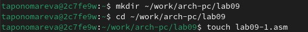{#fig:001 width=70%}

Ввожу в файл lab09-1.asm текст программы из листинга 9.1 (рис. [-@fig:002]).

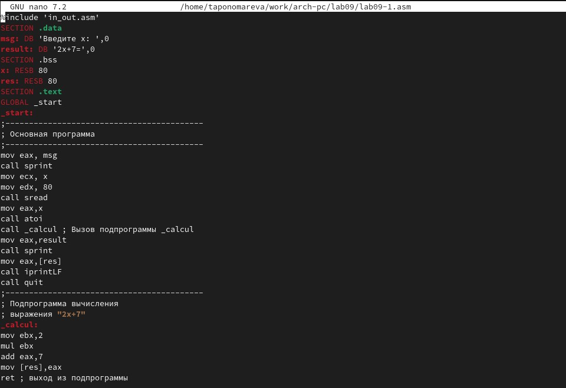{#fig:002 width=70%}

Создаю исполняемый файл и проверяю его работу (рис. [-@fig:003]). Программа работает корректно и при вводе x=10 дает результат 27.

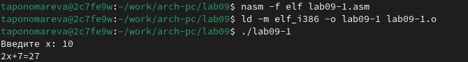{#fig:003 width=70%}

Изменяю текст программы, добавив подпрограмму _subcalcul в подпрограмму _calcul, для вычисления выражения f(g(x)), где x вводится с клавиатуры.

Текст программы в lab09-1.asm

```
%include 'in_out.asm'

SECTION .data
msg: DB 'Введите x: ', 0
result: DB '2(3x-1)+7=', 0

SECTION .bss
x: RESB 80
res: RESB 80

SECTION .text
GLOBAL _start
_start:
;------------------------------------------
; Основная программа
;------------------------------------------
mov eax, msg
call sprint

mov ecx, x
mov edx, 80
call sread

mov eax,x
call atoi

call _calcul ; Вызов подпрограммы _calcul

mov eax,result
call sprint
mov eax,[res]
call iprintLF

call quit
;------------------------------------------
; Подпрограмма вычисления
; выражения "2x+7"
_calcul:
push eax
call _subcalcul

mov ebx, 2
mul ebx
add eax, 7

mov [res],eax
pop eax
ret ; выход из подпрограммы
;------------------------------------------
; Подпрограмма вычисления
; выражения "3x-1"
_subcalcul:
mov ebx, 3
mul ebx
sub eax, 1
ret
```
Компилирую исполняемый файл и проверяю его работу (рис. [-@fig:004]). Заметим, что программа работает корректно, выводя 65 при x=10.

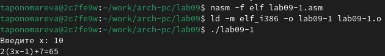{#fig:004 width=70%}

## Отладка программам с помощью GDB

Создаю файл lab09-2.asm (рис. [-@fig:005]).

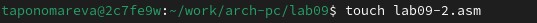{#fig:005 width=70%}

Ввожу в файл lab09-2.asm текст программы из листинга 9.2 (рис. [-@fig:006]).

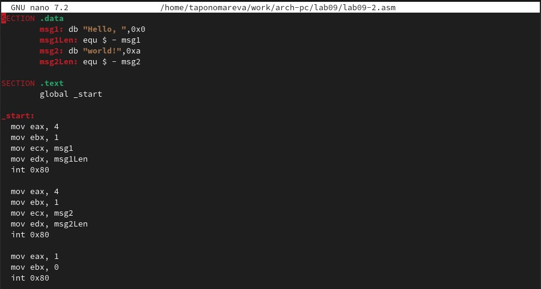{#fig:006 width=70%}

Получаю исполняемый файл. Так как для работы с GDB в исполняемый файл необходимо добавить отладочную информацию,то для этого провожу трансляцию программ с ключом -g (рис. [-@fig:007]).

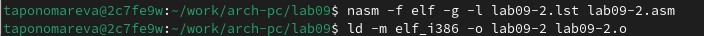{#fig:007 width=70%}

Загружаю исполняемый файл в отладчик gdb (рис. [-@fig:008]).

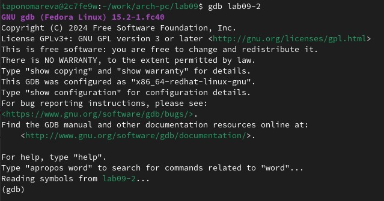{#fig:008 width=70%}

Проверяю работу программы, запустив ее в оболочке GDB с помощью команды run (рис. [-@fig:009]). Программа выводит на экран надпись "Hello, world!", что указывает на правильность работы программы.

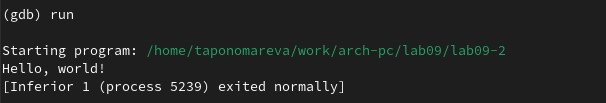{#fig:009 width=70%}

Для более подробного анализа программы установливаю брейкпоинт на метку _start, с которой начинается выполнение любой ассемблерной программы, и запускаю её (рис. [-@fig:0010]).

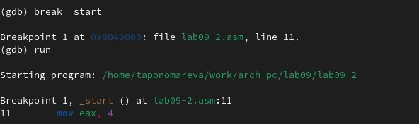{#fig:0010 width=70%}

Затем рассматриваю дисассимилированный код программы с помощью команды disassemble, начиная с метки _start (рис. [-@fig:0011]).

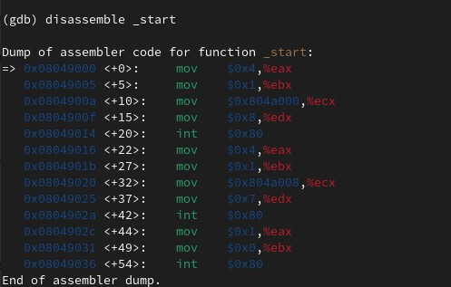{#fig:0011 width=70%}

Переключаюсь на отображение команд с Intel’овским синтаксисом, введя команду set disassembly-flavor intel (рис. [-@fig:0012]).

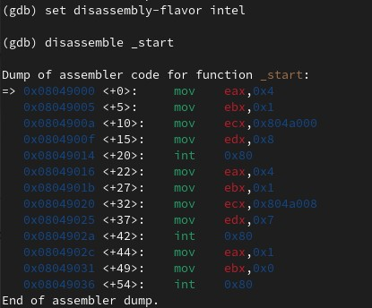{#fig:0012 width=70%}

Различия отображения синтаксиса машинных команд в режимах ATT и Intel.

Синтаксис машинных команд в режимах ATT и Intel различается порядком операндов, обозначениями регистров, префиксами констант и обращением к памяти. В синтаксисе Intel первый операнд — назначение, второй — источник (например, mov eax, ebx), тогда как в ATT — наоборот (movl %ebx, %eax). Регистры в ATT начинаются с %, а в Intel указываются без префиксов. Константы в ATT начинаются с $, тогда как в Intel они пишутся без символов.

Включаю режим псевдографики для более удобного анализа программы (рис. [-@fig:0013]).

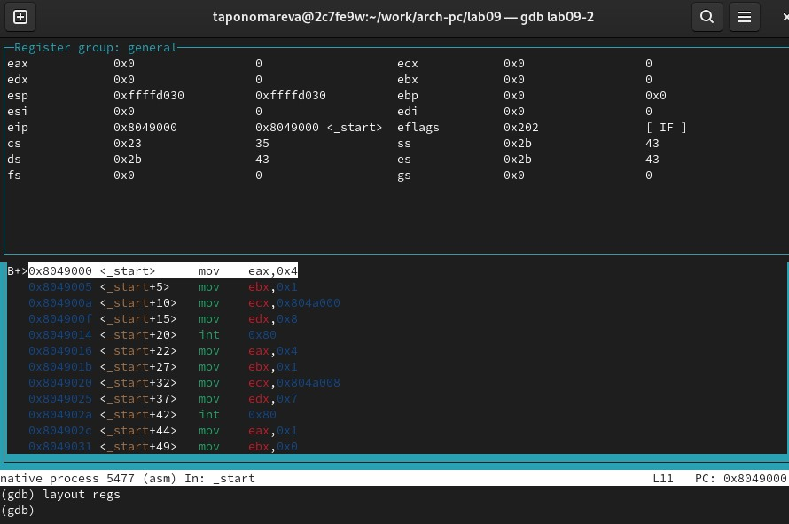{#fig:0013 width=70%}

## Добавление точек останова

Поскольку на предыдущих шагах была установлена точка останова по имени метки (_start). Проверяю это с помощью команды info breakpoints (кратко i b) (рис. [-@fig:0014]).

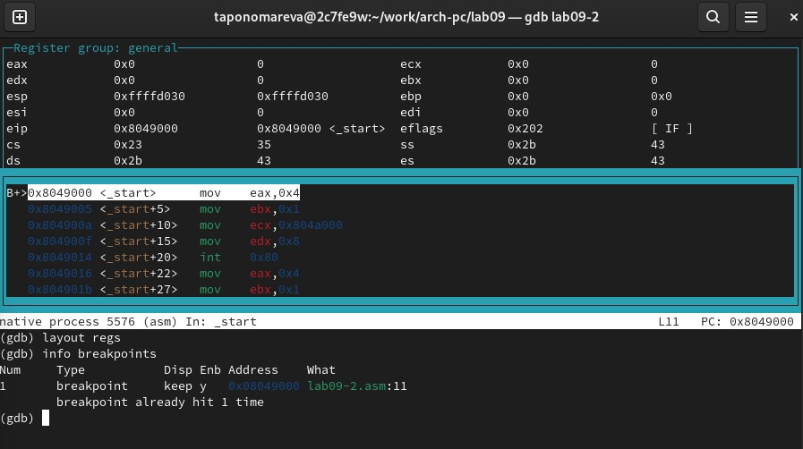{#fig:0014 width=70%}

Устанавливаю еще одну точку останова по адресу инструкции. Определяю адрес предпоследней инструкции (mov ebx,0x0) и устанавливаю точку останова при помощи команды break *<адрес> (рис. [-@fig:0015]).

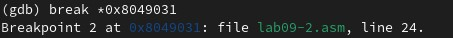{#fig:0015 width=70%}

Рассматриваю информацию о всех установленных точках останова (рис. [-@fig:0016]).

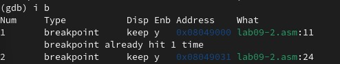{#fig:0016 width=70%}

##  Работа с данными программы в GDB

Рассматриваю содержимое регистров с помощью команды info registers (или i r) (рис. [-@fig:0017]).

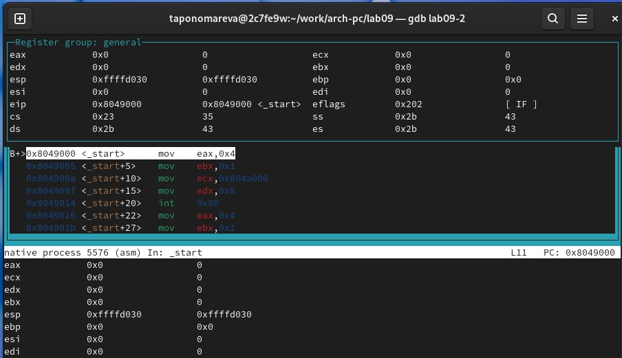{#fig:0017 width=70%}

Смотрю содержимое переменных msg1 и msg2 по имени и по адресу (рис. [-@fig:0018]).

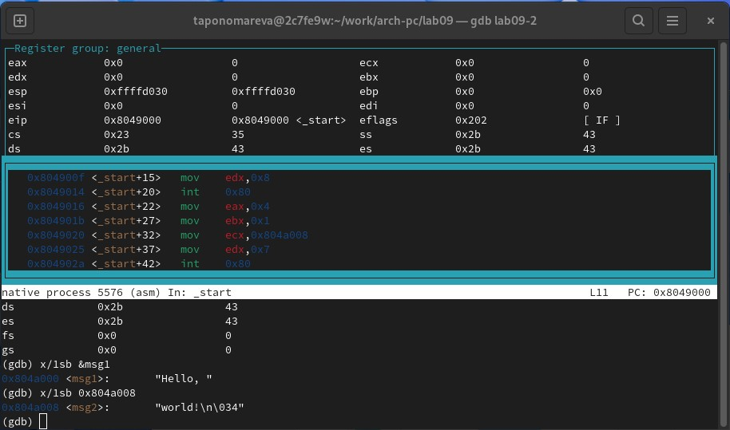{#fig:0018 width=70%}

Меняю содержимое переменных msg1 и msg2 по имени и по адресу (рис. [-@fig:0019]).

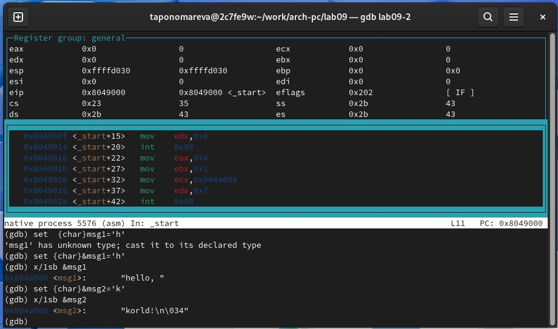{#fig:0019 width=70%}

Вывожу в различных форматах значение регистра edx (рис. [-@fig:0020]).

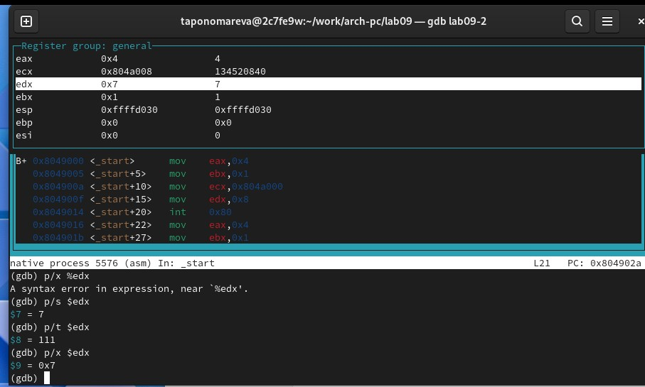{#fig:0020 width=70%}

С помощью команды set изменяю значение регистра ebx (рис. [-@fig:0021]). В первом случае '2' - это символ с ASCII-кодом 50. Команда p/s $ebx интерпретирует содержимое регистра $ebx как строку символов. Результат равен 50, потому что ASCII-код символа '2' соответствует 50. Во втором случае 2 - это целое число, интерпретируемое как указатель в памяти, который не ведет к осмысленной строке.

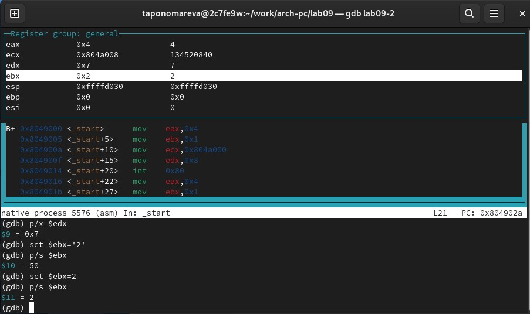{#fig:0021 width=70%}

Завершаю выполнение программы с помощью команды continue (сокращенно c) или
stepi (сокращенно si) и выхожу из GDB с помощью команды quit (сокращенно q).

## Обработка аргументов командной строки в GDB

Скопирую файл lab8-2.asm, созданный при выполнении лабораторной работы №8,
с программой выводящей на экран аргументы командной строки (Листинг 8.2) в файл с
именем lab09-3.asm (рис. [-@fig:0022]).

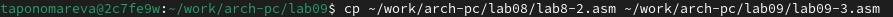{#fig:0022 width=70%}

Создаю исполняемый файл (рис. [-@fig:0023]).

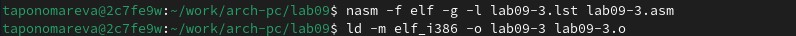{#fig:0023 width=70%}

Для загрузки в gdb программы с аргументами необходимо использовать ключ --args.
Загружаю исполняемый файл в отладчик, указав аргументы (рис. [-@fig:0024]).

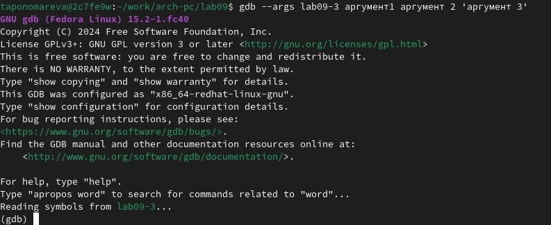{#fig:0024 width=70%}

Для начала устанавливаю точку останова перед первой инструкцией в программе и запускаю ее (рис. [-@fig:0025]). Затем рассматриваю остальные позиции стека. Шаг изменения адреса равен 4, поскольку это соответствует размеру одного элемента типа void* на 32-битных системах с размером указателя в 4 байта. Это означает, что при обращении к следующему элементу в стеке необходимо сдвинуть указатель на 4 байта.

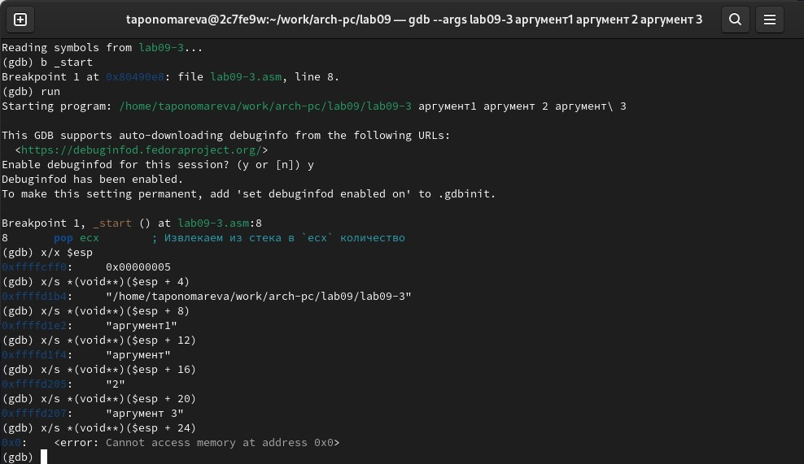{#fig:0025 width=70%}

#   Задания для самостоятельной работы

1) Преобразовываю программу из лабораторной работы №8(Задание №1 для самостоятельной работы), реализовав вычисление значения функции f(x)=10x-5 как подпрограмму.

Код программы файла lab09-4.asm
```
 %include 'in_out.asm'

SECTION .data
msg_function db "Функция: f(x) = 10x - 5", 0
msg_res db "Результат: ", 0

SECTION .text
GLOBAL _start

_start:
   mov eax, msg_function
   call sprintLF

   pop ecx
   pop edx
   sub ecx, 1
   mov esi, 0

next:
   cmp ecx, 0h
   jz _end
   pop eax
   call atoi

   call _solve_f

   add esi, eax
   loop next

_end: 
   mov eax, msg_res
   call sprint
   mov eax, esi
   call iprintLF
   call quit

_solve_f:
   mov ebx, 10        ; Загружаем множитель 10 в ebx
   mul ebx            ; Умножаем eax на 10, результат в eax (eax = eax * 10)
   sub eax, 5         ; Вычитаем 5 из eax (eax = eax - 5)
   ret                ; Возвращаемся из подпрограммы

```
Компилирую исполняемый файл и проверяю его работу (рис. [-@fig:0026]). Программа работает корректно, т.к. 10*1-5 + 
10*2-5+10*3-5 = 5+15+25 = 45.

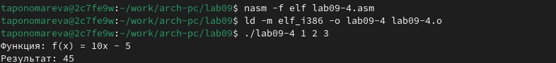{#fig:0026 width=70%}

2)
Проанализировав программу при помощи отладчика GDB, можно заметить, что ошибка заключается в неправильном использовании регистров при выполнении арифметических операций. В инструкции mul ecx результат умножения сохраняется в регистрах edx и eax, но программа ожидает, что результат будет в ebx, что приводит к потере данных и неправильному результату (рис. [-@fig:0027]).

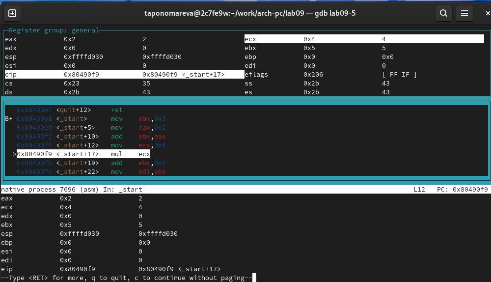{#fig:0027 width=70%}

После исправления кода получаем верный ответ (рис. [-@fig:0028]).

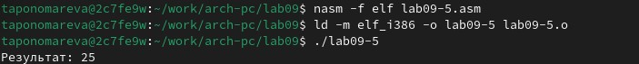{#fig:0028 width=70%}

Исправленный код
```
%include 'in_out.asm'
SECTION .data
div: DB 'Результат: ',0

SECTION .text
GLOBAL _start
_start:
; ---- Вычисление выражения (3+2)*4+5
mov eax,3     
add eax,2        
mov ecx,4        
mul ecx        
add eax,5      
mov edi,eax      

; ---- Вывод результата на экран
mov eax,div
call sprint
mov eax,edi
call iprintLF
call quit
```

Загружаю отчет на GitHub.

# Выводы

В ходе выполнения лабораторной работы были приобретены навыки написания программ с использованием подпрограмм. Было произведено знакомство с методами отладки при помощи GDB и его основными возможностями.

# Список литературы{.unnumbered}

1. [Курс на ТУИС](https://esystem.rudn.ru/course/view.php?id=112)
2. [Лабораторная работа №9](https://esystem.rudn.ru/pluginfile.php/2089096/mod_resource/content/0/%D0%9B%D0%B0%D0%B1%D0%BE%D1%80%D0%B0%D1%82%D0%BE%D1%80%D0%BD%D0%B0%D1%8F%20%D1%80%D0%B0%D0%B1%D0%BE%D1%82%D0%B0%20%E2%84%969.%20%D0%9F%D0%BE%D0%BD%D1%8F%D1%82%D0%B8%D0%B5%20%D0%BF%D0%BE%D0%B4%D0%BF%D1%80%D0%BE%D0%B3%D1%80%D0%B0%D0%BC%D0%BC%D1%8B.%20%D0%9E%D1%82%D0%BB%D0%B0%D0%B4%D1%87%D0%B8%D0%BA%20..pdf)
