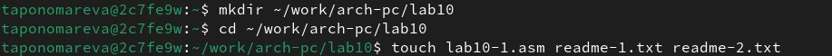
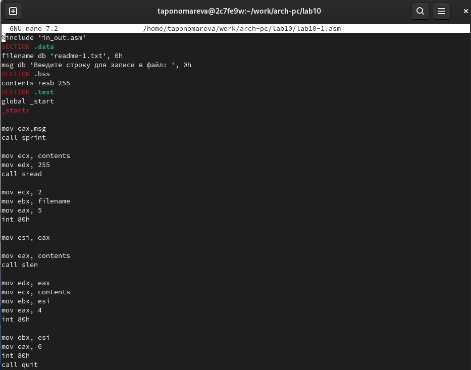
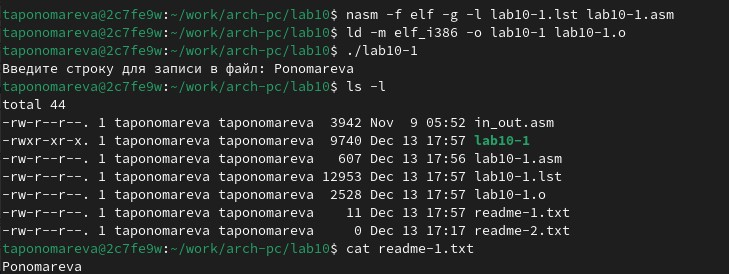
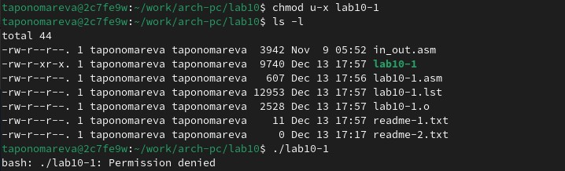
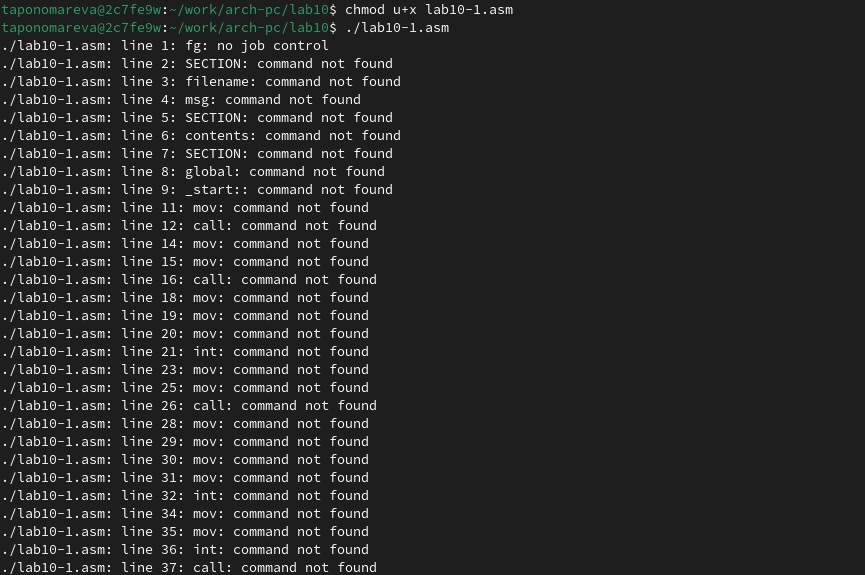
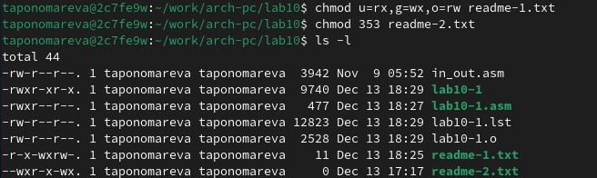
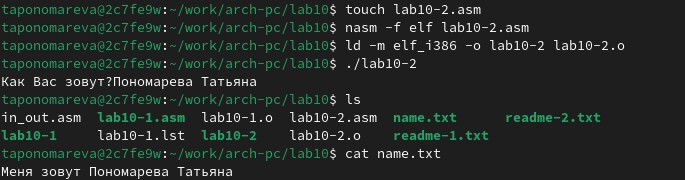

---
## Front matter
title: "Отчёт по лабораторной работе №10"
subtitle: "Дисциплина: Архитектура компьютера"
author: "Пономарева Татьяна Александровна"

## Generic otions
lang: ru-RU
toc-title: "Содержание"

## Bibliography
bibliography: bib/cite.bib
csl: pandoc/csl/gost-r-7-0-5-2008-numeric.csl

## Pdf output format
toc: true # Table of contents
toc-depth: 2
lof: true # List of figures
lot: true # List of tables
fontsize: 12pt
linestretch: 1.5
papersize: a4
documentclass: scrreprt
## I18n polyglossia
polyglossia-lang:
  name: russian
  options:
	- spelling=modern
	- babelshorthands=true
polyglossia-otherlangs:
  name: english
## I18n babel
babel-lang: russian
babel-otherlangs: english
## Fonts
mainfont: IBM Plex Serif
romanfont: IBM Plex Serif
sansfont: IBM Plex Sans
monofont: IBM Plex Mono
mathfont: STIX Two Math
mainfontoptions: Ligatures=Common,Ligatures=TeX,Scale=0.94
romanfontoptions: Ligatures=Common,Ligatures=TeX,Scale=0.94
sansfontoptions: Ligatures=Common,Ligatures=TeX,Scale=MatchLowercase,Scale=0.94
monofontoptions: Scale=MatchLowercase,Scale=0.94,FakeStretch=0.9
mathfontoptions:
## Biblatex
biblatex: true
biblio-style: "gost-numeric"
biblatexoptions:
  - parentracker=true
  - backend=biber
  - hyperref=auto
  - language=auto
  - autolang=other*
  - citestyle=gost-numeric
## Pandoc-crossref LaTeX customization
figureTitle: "Рис."
tableTitle: "Таблица"
listingTitle: "Листинг"
lofTitle: "Список иллюстраций"
lotTitle: "Список таблиц"
lolTitle: "Листинги"
## Misc options
indent: true
header-includes:
  - \usepackage{indentfirst}
  - \usepackage{float} # keep figures where there are in the text
  - \floatplacement{figure}{H} # keep figures where there are in the text
---

# Цель работы

Приобретение навыков написания программ для работы с файлами.

# Теоретическое введение

ОС GNU/Linux является многопользовательской операционной системой. И для обеспечения защиты данных одного пользователя от действий других пользователей существуют
специальные механизмы разграничения доступа к файлам. Кроме ограничения доступа, данный механизм позволяет разрешить другим пользователям доступ данным для совместной
работы.

# Выполнение лабораторной работы

Создаю каталог для программам лабораторной работы № 10, перехожу в него и создаю файлы lab10-1.asm, readme-1.txt и readme-2.txt (рис. [-@fig:001]).

{#fig:001 width=70%}

Ввожу в файл lab10-1.asm текст программы из листинга 10.1 (рис. [-@fig:002]).

{#fig:002 width=70%}

Создаю исполняемый файл и проверяю его работу (рис. [-@fig:003]). Программа запрашивает ввести строку, затем она создает файл readme-1.txt с введенным текстом. Программа работает корректно.

{#fig:003 width=70%}

С помощью команды chmod изменяю права доступа к исполняемому файлу lab10-1, запретив его выполнение (рис. [-@fig:004]). Вследствие этого система запрещает запуск файла lab10-1, т.к. у меня (владельца) нет прав на исполнение программы.

{#fig:004 width=70%}

Затем с помощью команды chmod изменяю права доступа к файлу lab10-1.asm с исходным текстом программы, добавив права на исполнение (рис. [-@fig:005]). Программа выдает "command not found", потому что lab10-1.asm воспринимает строки как команды, но эти строки не являются командами bash, поэтому выполнения не происходит.

{#fig:005 width=70%}

В соответствии с вариантом в таблице 10.4 (у меня 3 вариант) предоставляю права доступа к файлу readme-1.txt, представленные в символьном виде (r-x -wx rw-), а для файла readme-2.txt – в двоичном виде (011 101 011). Сначала символьный вид представляю командой chmod u=rx,g=wx,o=rw readme-1.txt, потом перевожу из двоичной системы в восьмеричную и получаю 353 (chmod 353 readme-2.txt). Проверяю правильность выполнения с помощью команды ls -l (рис. [-@fig:006]). Заметим, что права доступа были изменены.

{#fig:006 width=70%}

# Задания для самостоятельной работы

Пишу программу, работающую по следующему алгоритму: запрос на ввод имени, ввод с клавиатуры, создание файла name.txt, запись в файл сообщения "Меня зовут ", добавление в файл строки, введенной с клавиатуры, закрытие файла. Программа при запуске запрашивает имя и потом выводит "Меня зовут " + введенная с клавиатуры строка, что и показывает корректность работы lab10-2 (рис. [-@fig:007]).

{#fig:007 width=70%}

Код программы

```
%include 'in_out.asm'

SECTION .data
filename db 'name.txt', 0
starter db 'Как Вас зовут?', 0
firstline db 'Меня зовут ', 0

SECTION .bss
name resb 512

SECTION .text
global _start
_start:
  mov eax, starter
  call sprint

  mov ecx, name
  mov edx, 512
  call sread

  mov eax, 8
  mov ebx, filename
  mov ecx, 0744o
  int 80h

  mov esi, eax

  mov eax, firstline
  call slen
  mov edx, eax
  mov ecx, firstline
  mov ebx, esi
  mov eax, 4
  int 80h

  mov eax, name
  call slen
  mov edx, eax
  mov ecx, name
  mov ebx, esi
  mov eax, 4
  int 80h

  mov ebx, esi
  mov eax, 6
  int 80h

  call quit
```

Загружаю отчёт на GitHub.

# Выводы

В ходе выполнения лабораторной работы были приобретены навыки написания программ для работы с файлами.

# Список литературы{.unnumbered}

1. [Курс на ТУИС](https://esystem.rudn.ru/course/view.php?id=112)
2. [Лабораторная работа №10](https://esystem.rudn.ru/pluginfile.php/2089097/mod_resource/content/0/%D0%9B%D0%B0%D0%B1%D0%BE%D1%80%D0%B0%D1%82%D0%BE%D1%80%D0%BD%D0%B0%D1%8F%20%D1%80%D0%B0%D0%B1%D0%BE%D1%82%D0%B0%20%E2%84%9610.%20%D0%A0%D0%B0%D0%B1%D0%BE%D1%82%D0%B0%20%D1%81%20%D1%84%D0%B0%D0%B9%D0%BB%D0%B0%D0%BC%D0%B8%20%D1%81%D1%80%D0%B5%D0%B4%D1%81%D1%82%D0%B2%D0%B0%D0%BC%D0%B8%20Nasm.pdf)
